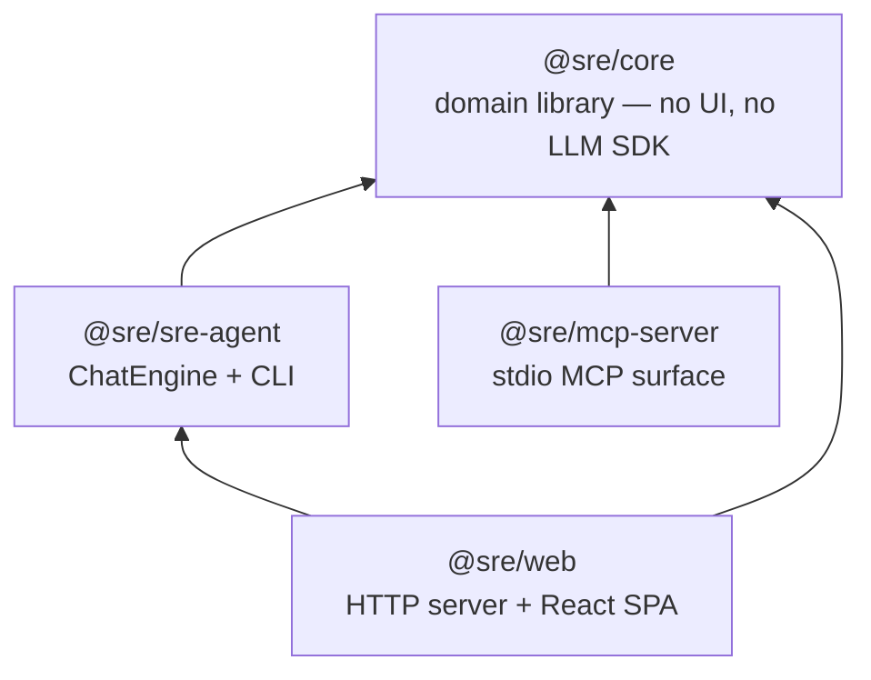
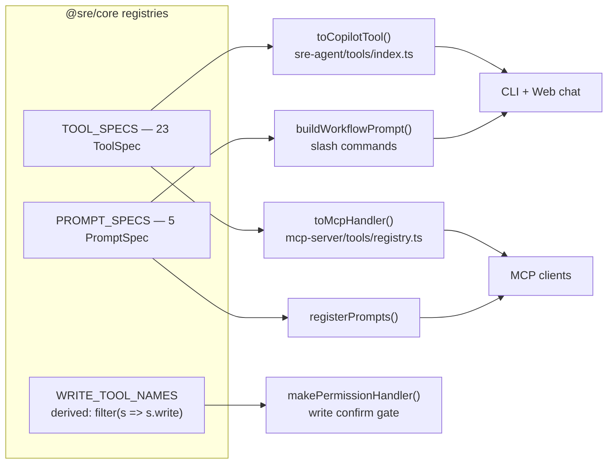
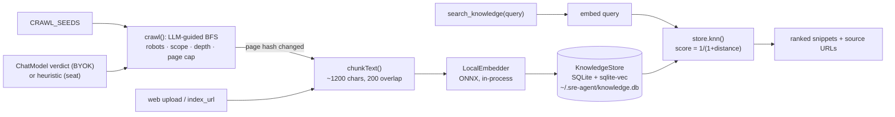
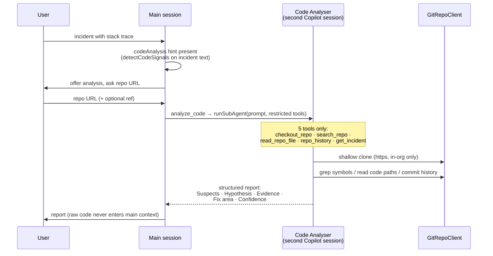

# SRE Agent — Architecture & Design

> Consolidated architecture of the implemented system as of 2026-07-10.
> Per-feature design rationale lives in [`docs/superpowers/specs/`](superpowers/specs/); this
> document describes what was actually built and how the pieces fit together.

## 1. Overview

The SRE Agent is an AI-powered operations assistant for SRE teams. It unifies
**ServiceNow** (incidents, changes), **Azure DevOps** (work items *and* Git
repositories), **SharePoint** (incident documents), and **internal documentation**
(local RAG index) behind a single conversational interface, delivered as a CLI
chat, a web UI, and an MCP server.

Two organisational constraints shaped the entire design:

1. **MCP servers are blocked** in the org's GitHub Copilot rollout → the agent
   runs on the official **GitHub Copilot SDK** (`@github/copilot-sdk`) using each
   engineer's existing Copilot seat, with tools registered via `defineTool`
   (not MCP). The MCP server is retained as a hedge for environments where MCP
   is permitted.
2. **Azure DevOps PATs are banned** → ADO access shells out to the **Azure CLI**
   (`az boards`) under an `az login` / Microsoft Entra session. A legacy PAT
   client exists behind the same interface for environments that still allow it.

## 2. System context

```mermaid
flowchart LR
    user([SRE Engineer])

    subgraph surfaces [Delivery surfaces]
        cli[CLI REPL<br/>@sre/sre-agent]
        web[Web UI<br/>@sre/web]
        mcp[MCP server<br/>@sre/mcp-server]
    end

    subgraph engine [Shared engine & domain]
        chatengine[ChatEngine<br/>Copilot SDK sessions]
        core[@sre/core<br/>clients · services · registries]
    end

    subgraph external [External systems]
        copilot[GitHub Copilot<br/>seat inference]
        byok[BYOK LLM<br/>Azure OpenAI / Anthropic]
        snow[ServiceNow<br/>REST Table API]
        ado[Azure DevOps<br/>az boards CLI]
        adorepos[ADO Git repos<br/>read-only git]
        sp[SharePoint<br/>MS Graph]
        docs[Internal docs<br/>wikis · runbooks]
    end

    user --> cli & web
    user -. any MCP client .-> mcp
    cli & web --> chatengine --> core
    mcp --> core
    chatengine --> copilot
    chatengine -. LLM_MODE=byok .-> byok
    core --> snow & ado & adorepos & sp
    core -- crawl + local index --> docs
```

Everything sensitive stays local: the RAG index (SQLite) and embeddings
(in-process ONNX) live on the engineer's machine; the web UI binds to loopback
only; no PATs, no MCP transport to the LLM.

## 3. Monorepo topology

npm-workspaces monorepo, TypeScript ESM, `tsc -b` project references:



| Package | Role | Key deps |
|---|---|---|
| `@sre/core` | All domain logic: clients, services, tool/prompt registries, config, DI runtime | `zod@3`, `undici`, `better-sqlite3` + `sqlite-vec`, `@huggingface/transformers` |
| `@sre/sre-agent` | Copilot-SDK engine + terminal REPL (`sre-agent` bin) | `@sre/core`, `@github/copilot-sdk`, `zod@4` |
| `@sre/web` | Localhost web UI wrapping the agent's engine | `@sre/sre-agent`, `@sre/core`, React 18, Vite, Tailwind |
| `@sre/mcp-server` | Same tools/prompts over MCP stdio (hedge surface) | `@sre/core`, `@modelcontextprotocol/sdk` |

Note the zod major-version split: the Copilot SDK requires zod v4 (sre-agent),
while core/mcp-server stay on v3 — no zod schema object crosses the package
boundary (specs export *raw shapes*, each adapter wraps them with its own zod).

## 4. Central design principle: define once, project everywhere

The single most important pattern in the codebase: **every tool and workflow
prompt is defined exactly once in core, then projected onto each surface by a
thin adapter.** Surfaces cannot drift because there is nothing surface-specific
to maintain.



`ToolSpec` (`core/src/tools/spec.ts`):

```ts
{
  name: string;
  description: string;              // one description, both surfaces
  schema: ZodRawShape;              // raw shape: MCP registers directly,
                                    // Copilot adapter wraps in z.object()
  write?: boolean;                  // mutates external state → confirm-gated
  enabledWhen?: (c: AppConfig) => string | null;  // config-driven availability
  run(rt: McpRuntime, args): Promise<object>;
}
```

- `WRITE_TOOL_NAMES` is **derived** from `spec.write`, never hand-maintained —
  adding a write tool automatically puts it behind the human-confirm gate.
- `ToolError` is the expected-failure channel: surfaced verbatim to the model;
  anything else thrown is formatted as an unexpected error. The Copilot adapter
  never throws (returns `{error}`), keeping turns alive.
- The 24 tools by domain: 10 ServiceNow (all read), 7 Azure DevOps work-item
  (3 writes: `create_bug_from_incident`, `create_work_item`, `clone_work_item`),
  2 knowledge/RAG, 1 SharePoint, 2 work-item CSV, 4 git-repo (all read).
  A 25th tool, `analyze_code`, is agent-only (see §6.3).

## 5. `@sre/core` — domain library

### 5.1 Layering

```
config.ts   → zod env schema, loadConfig/buildAppConfig (fail-fast, cross-field checks)
runtime.ts  → McpRuntime DI container: config → clients → services, wired once
clients/    → I/O boundary (ServiceNow REST, ADO az/PAT, git, Graph, crawler, embedder, chat)
services/   → pure business logic over clients (SLA risk, staleness, correlation, RAG, …)
tools/      → TOOL_SPECS registry (the only place behavior meets the model)
prompts/    → PROMPT_SPECS registry (workflow playbooks)
```

`createMcpRuntime()` is the composition root. Optional capabilities appear as
optional members: `sharePoint?` only when `SHAREPOINT_ENABLED`, `gitRepos?`
only when an ADO org URL is configured — tools re-guard these at run time in
addition to their `enabledWhen` config gate.

### 5.2 Notable clients

- **`ServiceNowClient`** — REST Table API via undici with optional proxy
  dispatcher; maps `{value, display_value}` rows to typed `Incident`/`ChangeRecord`.
- **`AzureDevOpsClient`** interface with two implementations selected by
  `ADO_AUTH_MODE`: **`AzBoardsClient`** (default; shells out to `az boards`
  through `execFile`, Windows `az.cmd`→cmd.exe verbatim-arg handling) and
  **`AdoPatClient`** (legacy REST + PAT). A shared WIQL builder serves both.
  Verbose ADO JSON is mapped to a slim `WorkItem` before reaching the model.
- **`GitRepoClient`** — read-only git for incident code analysis (security
  invariants in §8).
- **`LocalEmbedder`** — in-process embeddings via transformers.js/ONNX
  (default `Xenova/bge-small-en-v1.5`, 384-dim); offline mode via
  `EMBED_MODEL_PATH`. Serialized `embed()` queue (single ONNX session) and a
  mandatory `dispose()` (ONNX aborts the process if torn down while live —
  every exit path awaits `knowledge.close()` and uses `process.exitCode`, not
  `process.exit()`).
- **`ChatModel`** — optional one-shot chat client (OpenAI/Azure/Anthropic) used
  only by the crawler's relevance verdicts; absent in seat mode.
- **SharePoint** — `GraphClient` (pagination, 429 backoff) with a delegated
  Graph token obtained from the user's `az` session; document text extraction
  for docx/xlsx/pptx/pdf via lazily imported parsers.

### 5.3 Knowledge / RAG pipeline



Key decisions:
- **Embeddings are local and mandatory-local**: neither Copilot seat nor
  Anthropic expose an embeddings API, so embedding cannot ride the chat LLM.
  Decoupling embeddings (in-process) from verdict chat (optional, pluggable)
  makes the crawler work identically in seat and BYOK modes.
- **One combined relevance+link-keep verdict per page** halves crawl LLM cost;
  in seat mode a heuristic identity verdict flows through the *same* pipeline,
  still bounded by scope/depth/cap gates.
- The store pins `{embed model, dim}` in metadata and refuses to open on
  mismatch (forces deliberate re-index instead of silent garbage results).
- Retrieval is **agentic RAG**: a system-prompt nudge (appended, not replacing
  SDK guardrails) plus explicit `search_knowledge` steps in all four workflow
  prompts steer the model; there is no forced pre-retrieval injection.

## 6. `@sre/sre-agent` — engine and CLI

### 6.1 ChatEngine

`ChatEngine` (`src/engine/engine.ts`) is the front-end-agnostic wrapper around
the Copilot SDK, consumed by both the CLI and the web server:

- **Session lifecycle** — `start()` builds a `CopilotClient` (injectable
  `clientFactory` seam for tests), creates a session with the full toolset and
  an **appended** system message (knowledge/SharePoint/code-analysis steering
  blocks, `mode:"append"` so SDK guardrails survive).
- **Turns** — `send()` uses `session.sendAndWait(prompt, turnTimeoutMs)`
  (default 300 s; the SDK's 60 s default times out mid-turn with reasoning
  models + slow ServiceNow). Deltas stream to `onDelta` during the wait.
- **Write gate** — `onPermissionRequest` → `makePermissionHandler`: any tool in
  `WRITE_TOOL_NAMES` requires a `confirm(summary)` round-trip (readline y/N in
  the CLI, modal dialog in the web UI). Non-TTY or thrown confirm → **deny** —
  failure never approves.
- **Provider modes** — seat (default) or BYOK (`LLM_MODE=byok` attaches a
  `provider` block: OpenAI-compatible, Azure deployment URLs, or Anthropic;
  local Ollama works through the same path with an empty key).

### 6.2 Copilot seat auth — env-token stripping

The single hardest field problem (root-caused live on Windows): the SDK runtime
tries ambient env tokens (`COPILOT_GITHUB_TOKEN` → `GH_TOKEN` → `GITHUB_TOKEN`)
**before** the stored `copilot login` OAuth. A stray non-Copilot token on the
box → every turn 403s. Mitigations, all shipped:

- **`COPILOT_IGNORE_ENV_TOKEN` (default `true`)** — when in seat mode with no
  explicit token, the engine hands the spawned runtime a cleaned env with all
  three token vars deleted, so the stored OAuth wins.
- Startup **auth preflight** logs `getAuthStatus()`; `authType === "env"` is
  the decisive tell and produces a loud warning.
- In-tool **`/login`** device flow (spawns the *same* bundled runtime the SDK
  uses, so credentials land in the same store) and a 403 → `/login` hint.

### 6.3 Code Analyser sub-agent

`analyze_code` is the agent-only 24th tool. Rather than letting the main chat
rummage through a repository (context bloat, tool sprawl), analysis is
delegated to an isolated second session:



Design points:

- **Isolation is architectural, not prompt-based**: the sub-agent session gets
  only the 5-tool allowlist, and its `onPermissionRequest` rejects everything
  (read-only by construction). The main conversation receives the final report
  string only.
- **Proactive engagement is structural, not model-dependent**: `detectCodeSignals`
  (regex detector with an extension allowlist to kill IP/semver/timestamp false
  positives) appends a `codeAnalysis` hint block to `get_incident` /
  `summarize_incident` output when signals are found and an ADO org is
  configured. The model is steered to *offer* analysis, quote the signal, and
  ask consent + repo URL — never auto-run.
- **Visibility**: `runSubAgent` emits labeled `SubAgentEvent`s
  (start/tool/done/error). Both presentation layers render a single quiet
  indicator ("🔬 Code Analyser is analysing the code…") and fold one line into
  the transcript; per-tool spam is suppressed at the presentation layer while
  the engine still emits full events (verbose consumers remain possible).
  `repo_url` is never echoed into progress lines.
- **Lazy engine ref**: the tool is constructed with `getEngine: () => engine`
  because the engine is constructed with the tool in its toolset — the
  `extraToolsFactory` seam in the web server reuses the same pattern across
  engine restarts.

### 6.4 CLI

`sre-agent` bin: subcommands `init` (interactive `.env` scaffold), `doctor`
(prereq checks with per-failure fixes), `crawl` (full ingest / `--status`),
default REPL. First run on a fresh clone self-bootstraps: scaffold → `az login`
check → Copilot device-flow login → chat. Slash commands map to PROMPT_SPECS
(`/triage`, `/review`, `/postmortem`, `/handover`); `/help`, `/login`, `/exit`
are local. SIGINT aborts the turn; second SIGINT quits (disposing the ONNX
session cleanly).

## 7. `@sre/web` — web UI

Stdlib-`http` server (no framework) + React 18/Vite/Tailwind SPA, styled to the
ING "Orange Direct" design system ([`docs/DESIGN.md`](DESIGN.md)).

### 7.1 Server design

- **One `ChatEngine`, one in-flight turn** (single-user by design; multi-user
  upgrade path documented in the web-shell spec). `engine-host.ts` owns the
  engine, rebuilds it on `restart()` (e.g. after settings save or login).
- **Transport: SSE down, POST up.** `GET /api/stream` is the single event
  channel; POSTs (`/api/chat`, `/api/confirm`, `/api/abort`, login, uploads)
  return `202` immediately and results arrive as events. New SSE clients
  receive a replayed snapshot (engine/auth/config state) on connect.
- **`ServerEvent` union** (`shared/events.ts`) is the typed server↔client
  contract: `delta`, `tool-start`, `subagent-status`, `turn-end`, `turn-error`,
  `confirm-request`, `device-code`, `auth-status`, `config-status`,
  `ingest-status`, `engine-state`.
- **Write confirm over the wire**: engine `confirm()` returns a promise held in
  a pending map, emits `confirm-request {id, summary}`; the modal's answer
  POSTs `/api/confirm`. A 5-minute timeout resolves to **deny** so a closed
  tab never wedges a turn.
- **Settings editor**: `GET/PUT /api/env` reads/writes the same `.env` the CLI
  uses. Saves are validated through `loadConfig()` **before** writing, merge
  non-destructively (comments and order preserved), then restart the engine.
  The settings view always shows every cataloged variable; a drift-guard test
  fails CI if a new env var is added without being cataloged.
- **Security posture**: binds `127.0.0.1` only; Copilot login is the only
  auth; the bundled Copilot runtime is a transitive dependency (no CLI
  install needed).

### 7.2 Client design

`useServerStream` = `EventSource` + a pure reducer (`applyServerEvent`) over
the event union — all UI state derives from the stream, so reconnects replay
cleanly. `foldActivity` commits streamed text plus any sub-agent activity block
into the persistent transcript at turn end. Sidebar integration dots
(ServiceNow / Azure Boards / Copilot / RAG) derive from `config-status` events.

## 8. Security design

| Concern | Mitigation | Where |
|---|---|---|
| Org bans PATs | ADO via `az boards` under Entra login; PAT client legacy-only | `core/clients/ado/` |
| Org blocks MCP in Copilot | Copilot SDK `defineTool`; MCP server separate, opt-in | `sre-agent`, `mcp-server` |
| Unattended writes | All 3 write tools behind y/N confirm; derived `WRITE_TOOL_NAMES`; deny-on-failure | `engine/permissions.ts` |
| Prompt-injected clone targets | `https:` only + host/org allowlist (`dev.azure.com/<org>`) on every repo URL | `core/clients/git.ts` |
| Credential leakage | PAT via per-invocation `http.extraHeader` (never in URL or `.git/config`); PAT + base64 redacted from errors; `repo_url` never echoed in progress | `git.ts`, `engine.ts` |
| Shell injection | `execFile` argv arrays everywhere (git, az); cmd.exe verbatim-arg quoting on Windows (CVE-2024-27980) | `git.ts`, `ado/az.ts` |
| Path escape | `realpath` containment check on repo file reads; binary rejection; output caps (64 KiB read, 200 grep hits) | `git.ts` |
| Crawler SSRF | Seeds and links scope-checked against `CRAWL_ALLOW_DOMAINS`; robots.txt respected; byte/page/depth caps | `services/knowledge/crawl.ts` |
| Sub-agent blast radius | 5-tool allowlist; permission handler rejects all; read-only git client has no mutating op | `tools/analyzeCode.ts`, `engine.ts` |
| Ambient token 403s | `COPILOT_IGNORE_ENV_TOKEN` env-strip (default on) | `engine.ts` |
| Secrets at rest | `.env` chmod 600; web `.env` editor loopback-only | `init.ts`, `web/server` |
| Data locality | RAG index + embeddings fully local; offline embed model path | `knowledge/`, `embedder.ts` |

## 9. Configuration

Single zod schema in core (`envSchema`) extended by the agent
(`agentSchema`) — one parse produces both `AgentConfig` and core `AppConfig`.
Fail-fast with named-variable messages; empty-string env values are coerced to
unset (a `.env` `KEY=` line must not defeat defaults). `.env` resolution order:
`$SRE_AGENT_ENV` → `./.env` → `packages/sre-agent/.env` → `~/.sre-agent/.env`.
`.env.example` documents every variable and is kept honest by a test
(`env-example.test.ts`).

## 10. Testing & CI

- **~589 test cases across 81 files** (core 48, sre-agent 17, web 9,
  mcp-server 7), Vitest workspace with 4 named projects; `@sre/core` aliased
  to *source* so package tests exercise unbuilt code.
- Engine tests use the `clientFactory` seam (fake Copilot client); web tests
  use `engineFactory`/`runtimeFactory` seams. External I/O is mocked; live
  smoke against real ADO/ServiceNow instances is a known, tracked gap.
- **CI** (`.github/workflows/ci.yml`): build+test matrix over
  {ubuntu, macos, windows} × node {20, 22}, plus a lint/format job.
- Process: every feature lands via spec → TDD plan → PR with review
  (specs and plans under `docs/superpowers/`).

## 11. Design decision log

| Decision | Why | Spec |
|---|---|---|
| Copilot SDK over MCP delivery | org blocked MCP in Copilot; seat auth already provisioned | [`2026-06-17-sre-agent-copilot-sdk-design.md`](superpowers/specs/2026-06-17-sre-agent-copilot-sdk-design.md) |
| `az boards` CLI, no PAT | org banned ADO PATs; Entra login validated live | same spec |
| Monorepo with shared registries | one definition per tool/prompt, zero surface drift | same spec |
| MCP server kept | hedge for MCP-permitted environments; resources are MCP-only | [`2026-06-11-standalone-mcp-design.md`](superpowers/specs/2026-06-11-standalone-mcp-design.md) |
| Local in-process embeddings | no embeddings API on seat or Anthropic; offline capable | [`2026-06-24-llm-agnostic-crawler-design.md`](superpowers/specs/2026-06-24-llm-agnostic-crawler-design.md) |
| Agentic RAG (steered tool, not forced injection) | keeps turns cheap when knowledge irrelevant; provider-independent | [`2026-06-25-rag-chat-integration-design.md`](superpowers/specs/2026-06-25-rag-chat-integration-design.md) |
| Web = SSE + single engine | simplest correct transport for one-user streaming; snapshot replay on reconnect | [`2026-06-25-web-shell-auth-chat-design.md`](superpowers/specs/2026-06-25-web-shell-auth-chat-design.md) |
| Code analysis as isolated sub-agent | context isolation + restricted blast radius vs. in-session repo tools | [`2026-07-06-git-repo-code-analyser-design.md`](superpowers/specs/2026-07-06-git-repo-code-analyser-design.md) |
| Structural proactive engagement | regex signal detector + hint block works on any model, both surfaces | [`2026-07-07-proactive-code-analysis-design.md`](superpowers/specs/2026-07-07-proactive-code-analysis-design.md) |
| Quiet sub-agent progress | per-tool timeline was noise; single labeled indicator, engine events intact | [`2026-07-08-quiet-subagent-progress-design.md`](superpowers/specs/2026-07-08-quiet-subagent-progress-design.md) |
