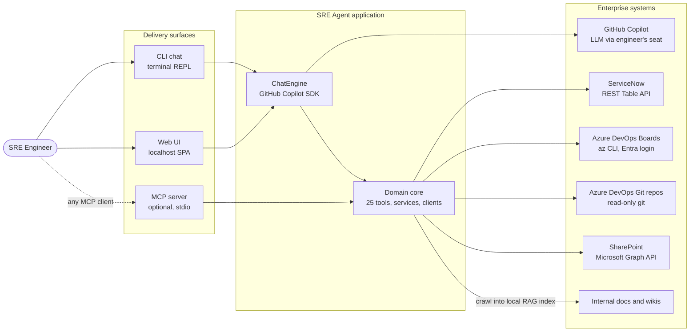
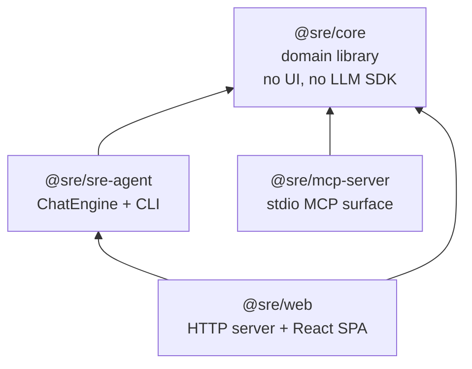
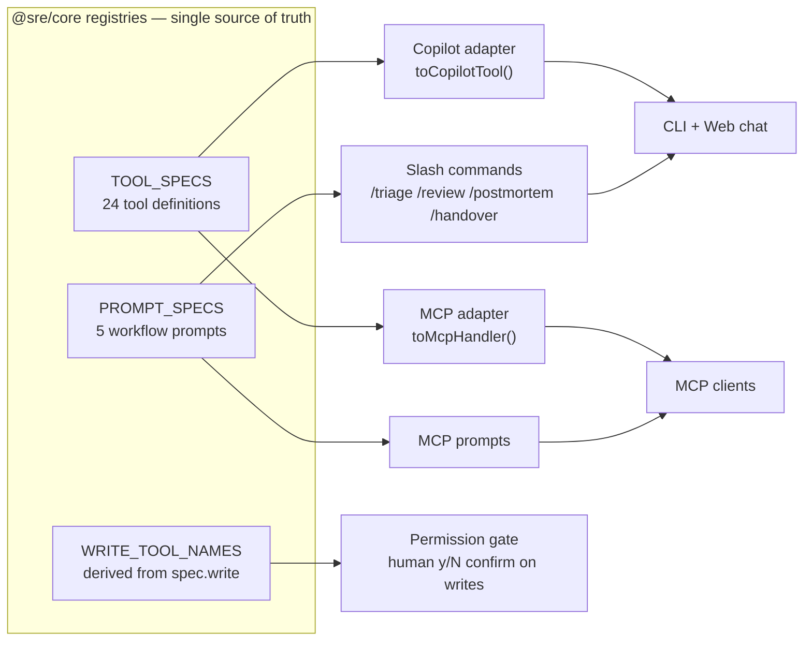
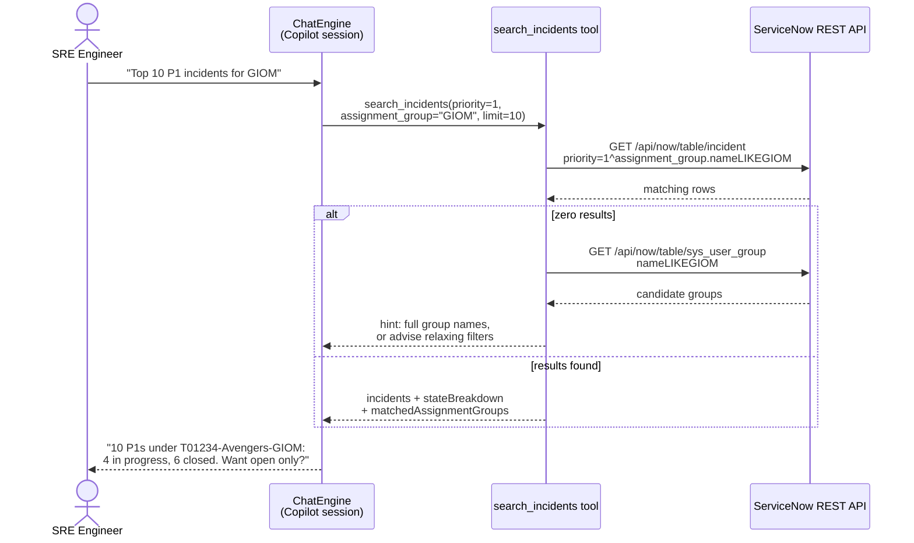
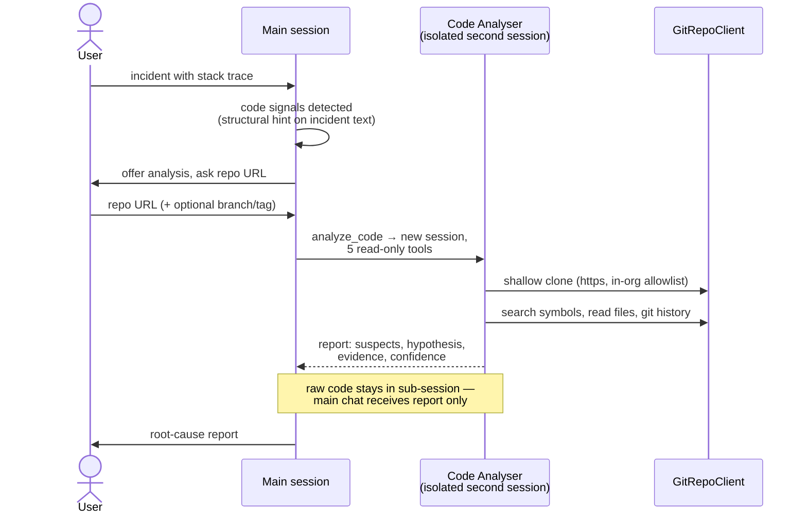
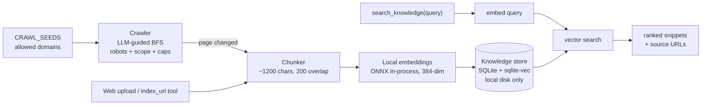
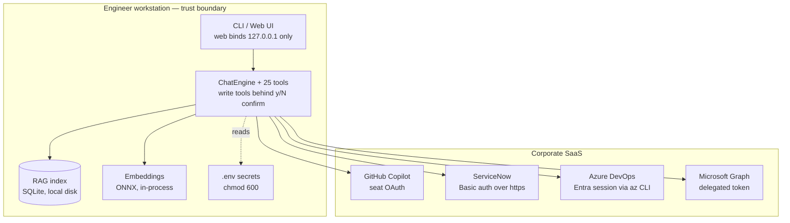

# SRE Agent — Architecture Board Review

> Prepared for the architecture board and management, 2026-07-16.
> Companion documents: [`ARCHITECTURE.md`](ARCHITECTURE.md) (engineering deep-dive),
> [`DESIGN.md`](DESIGN.md) (UI design system), decision specs under
> [`superpowers/specs/`](superpowers/specs/).

---

## 1. Executive summary

**What it is.** The SRE Agent is an AI-powered operations assistant for SRE
teams. An engineer asks questions in plain language — *"top 10 P1 incidents for
GIOM"*, *"what changed before this outage?"*, *"analyse the root cause of
INC0012345 in this repo"* — and the agent answers by querying **ServiceNow**,
**Azure DevOps**, **SharePoint**, and an **internal documentation index**, all
behind one conversational interface.

**Why it matters.** Incident triage today means swivel-chairing between four
systems with four query languages. The agent collapses that into one
conversation, and adds capabilities none of the source systems offer: automatic
incident-to-change correlation, SLA-risk detection, and delegated code
root-cause analysis on the repository behind an incident.

**How it fits our constraints.** Two organisational rules shaped the entire
architecture, and both are honored by construction rather than by exception:

| Constraint | Architectural answer |
|---|---|
| MCP servers are blocked in the org's GitHub Copilot rollout | The agent runs on the official **GitHub Copilot SDK** using each engineer's existing Copilot seat. No new LLM procurement, no MCP transport. An MCP server surface is retained as an opt-in hedge for permitted environments. |
| Azure DevOps Personal Access Tokens are banned | ADO access shells out to the **Azure CLI** (`az boards`) under the engineer's existing Microsoft Entra login. No stored tokens. |

**Security posture in one line:** everything sensitive stays on the engineer's
workstation — local RAG index, in-process embeddings, loopback-only web UI, no
PATs, and every state-changing action requires an explicit human confirmation.

**Scale of the delivered system:** 4 packages, 25 tools, 5 guided workflows,
3 delivery surfaces, 668 automated tests across 81 files, CI on
3 OS × 2 Node versions.

---

## 2. System context

### What
One application, three delivery surfaces (terminal CLI, localhost web UI,
optional MCP server), five integrated enterprise systems.



### How
The user converses with a **ChatEngine** (a wrapper around a GitHub Copilot SDK
session). The LLM decides which of the 25 registered tools to call; every tool
executes locally in the **domain core** and talks to the enterprise system over
its native API. The LLM never receives credentials and never talks to the
enterprise systems directly — it only sees tool inputs and outputs.

### Tools / APIs
| System | Integration | Auth |
|---|---|---|
| GitHub Copilot | `@github/copilot-sdk` (official SDK), streaming sessions | Engineer's Copilot seat (OAuth device flow) |
| ServiceNow | REST Table API (`/api/now/table/*`) via undici, optional corporate proxy | Basic auth over https |
| Azure DevOps Boards | `az boards` CLI subprocess (WIQL queries) | Microsoft Entra (`az login`) session |
| Azure DevOps Repos | Read-only `git` subprocess (shallow clone, grep, log) | Entra session; https-only, org allowlist |
| SharePoint | Microsoft Graph REST (pagination, 429 backoff), document text extraction (docx/xlsx/pptx/pdf) | Delegated Graph token from the `az` session |
| Internal docs | Local crawler → SQLite vector index (details §7) | n/a — local |
| BYOK option | Azure OpenAI / Anthropic / OpenAI-compatible / local Ollama via `LLM_MODE=byok` | API key, engineer-supplied |

---

## 3. Application architecture

### What
An npm-workspaces **monorepo** with one domain library and three thin surfaces.
All business logic lives in `@sre/core`; surfaces contain no domain code.



### How
Strict layering inside `@sre/core`:

```
config   → zod-validated environment schema, fail-fast on misconfiguration
runtime  → dependency-injection container: config → clients → services, wired once
clients  → the only I/O boundary (ServiceNow REST, az CLI, git, Graph, crawler, embedder)
services → pure business logic (SLA risk, staleness, incident–change correlation, RAG)
tools    → TOOL_SPECS registry — the only place behavior meets the model
prompts  → PROMPT_SPECS registry — guided workflow playbooks
```

Optional capabilities (SharePoint, git repos) appear as optional runtime
members, gated both by configuration (`enabledWhen`) and re-checked at run
time.

### Tools / APIs
TypeScript ESM throughout, `tsc -b` project references, `zod` for every
schema, `vitest` workspace for tests. The Copilot SDK requires zod v4 while
core stays on v3 — tool schemas cross the package boundary as *raw shapes*, and
each adapter wraps them with its own zod version, eliminating the version
conflict by design.

---

## 4. Core pattern: define once, project everywhere

### What
Every tool and workflow prompt is defined **exactly once** in core, then
projected onto each surface by a thin adapter. Surfaces cannot drift, because
there is nothing surface-specific to maintain.



### How
A `ToolSpec` carries a name, one description, a schema, an optional `write`
flag, a config-driven availability guard, and the handler. Governance falls
out of the data model:

- **`WRITE_TOOL_NAMES` is derived**, never hand-maintained — adding a write
  tool automatically places it behind the human-confirmation gate on every
  surface.
- Expected failures surface to the model as structured `{error}` payloads, so
  a failed tool call never kills a conversation turn.

### Tools / APIs
25 tools by domain: **10 ServiceNow** (all read-only), **7 Azure DevOps
work-item** (3 writes, each confirm-gated), **2 knowledge/RAG**,
**1 SharePoint**, **2 work-item CSV**, **4 git-repo** (all read-only), minus
overlap: 24 in the shared registry plus `analyze_code`, which exists only on
the agent surface (§6).

---

## 5. Agentic tool design — the incident query flow

### What
Tools are designed so the model succeeds with *human* inputs, not
system-perfect ones. Example: assignment groups. Users say "GIOM"; ServiceNow
stores `T01234-Avengers-GIOM`. Tools match the way the ServiceNow UI does
(case-insensitive contains), report what they matched, and turn empty results
into actionable next steps.



### How
Three deliberate behaviors:

1. **Tolerant matching** — every name filter (assignment group, assignee,
   configuration item) is a contains-match, mirroring the UI experience users
   already have. Filter values are sanitised against query injection.
2. **Transparency over assumption** — results carry a per-state breakdown and
   the full group names actually matched. The agent does not silently assume
   "open only"; it shows the composition and lets the user refine.
3. **Self-healing empty results** — a zero-hit search runs the diagnostic
   lookup the model *would have needed* (`sys_user_group`) and returns a hint
   distinguishing "no such group" from "group exists, other filters exclude
   everything". Dead ends become next actions.

### Tools / APIs
ServiceNow Table API encoded queries (`sysparm_query` with `LIKE`, `ORDERBY`),
`sys_user_group` lookup table, dedicated `lookup_assignment_groups` tool for
proactive name resolution.

---

## 6. Code Analyser — isolated sub-agent

### What
Code root-cause analysis is delegated to a **second, isolated LLM session**
with a restricted five-tool allowlist, instead of letting the main chat rummage
through repositories.



### How
- **Isolation is architectural, not prompt-based.** The sub-session receives
  only 5 read-only tools (`checkout_repo`, `search_repo`, `read_repo_file`,
  `repo_history`, `get_incident`) and its permission handler rejects every
  escalation. The main conversation receives the final report string only —
  file contents and search output never bloat the main context window.
- **Proactive engagement is structural.** A regex signal detector inspects
  incident text; when stack traces or file references are found, incident
  tools append a hint steering the model to *offer* analysis and ask consent —
  never to auto-run.
- **Progress is visible but quiet.** The engine emits labeled sub-agent events
  (start / per-tool / done); both UIs render a single unobtrusive indicator.

### Tools / APIs
Second `@github/copilot-sdk` session on the same authenticated client;
read-only `git` subprocess with https-only + organisation allowlist on clone
URLs, path-containment checks on file reads, and output caps.

---

## 7. Knowledge / RAG pipeline — fully local

### What
Internal documentation (wikis, runbooks) is crawled into a **local** vector
index and retrieved on demand during conversations. No document content or
embedding ever leaves the workstation.



### How
- **Embeddings run in-process** (transformers.js/ONNX, `bge-small-en-v1.5`)
  because neither a Copilot seat nor Anthropic exposes an embeddings API. This
  also enables a fully offline mode via a local model path.
- **Crawling is bounded**: seed/scope domain allowlist, robots.txt respected,
  byte/page/depth caps, change-detection by page hash so re-crawls are cheap.
- **Retrieval is agentic**: the model is steered (system-prompt nudge +
  workflow steps) to call `search_knowledge` when relevant, rather than
  force-injecting documents into every turn — keeping turns cheap when
  knowledge is irrelevant.
- The store pins the embedding model + dimensions in metadata and refuses to
  open on mismatch — a silent-garbage-results failure mode eliminated by
  design.

### Tools / APIs
SQLite + `sqlite-vec` (k-NN vector search), `@huggingface/transformers` (ONNX
runtime), local crawler over undici, `index_url` / `search_knowledge` tools.

---

## 8. Security architecture

### What
A single trust boundary: the engineer's workstation. Everything outside it is
reached with the engineer's own pre-existing enterprise identity.



### How — controls by threat

| Threat | Control |
|---|---|
| Unattended writes to enterprise systems | All 3 write tools require an explicit human y/N confirmation; the write list is derived, not hand-maintained; confirmation failure = deny |
| Prompt-injected repository targets | Clone URLs restricted to `https:` + `dev.azure.com/<org>` allowlist |
| Credential leakage | No PATs stored; secrets redacted from error text; repo URLs never echoed into progress output; `.env` chmod 600 |
| Shell injection | All subprocesses (`git`, `az`) invoked with argv arrays, never shell strings; Windows cmd.exe quoting hardened (CVE-2024-27980) |
| Path escape / data exfiltration via repo reads | `realpath` containment checks, binary rejection, output caps (64 KiB reads, 200 grep hits) |
| Crawler SSRF | Domain allowlist on every seed and link, robots.txt, byte/page/depth caps |
| Sub-agent blast radius | 5-tool read-only allowlist; all permission requests rejected |
| Query injection into ServiceNow | Encoded-query separator stripped from every filter value |
| Ambient token hijacking Copilot auth | Env-token stripping (default on) so the stored seat OAuth always wins |
| Network exposure of web UI | Loopback bind only; no remote access surface |

### Tools / APIs
No net-new identity: GitHub Copilot seat OAuth, Microsoft Entra (`az login`),
delegated Graph tokens, ServiceNow basic auth over https with optional
corporate proxy support.

---

## 9. Delivery surfaces

### What
Three ways to consume the same domain core, matching how different users work.

| Surface | For | Highlights |
|---|---|---|
| **CLI** (`sre-agent`) | Engineers in the terminal | Self-bootstrapping first run (`init` scaffold → `az login` check → Copilot device-flow login → chat); `doctor` diagnostics; slash-command workflows; streaming output |
| **Web UI** (localhost) | Engineers preferring a visual client | React 18 + Vite + Tailwind SPA, corporate design system; streaming chat over SSE; settings editor for `.env` with validation before write; integration status indicators; document upload into RAG |
| **MCP server** | MCP-permitted environments / other MCP clients | Same 24 tools + prompts over stdio; kept as a strategic hedge |

### How
The web server is deliberately minimal: Node's stdlib `http`, **SSE down /
POST up** as the only transport, a single typed event union as the
client-server contract, and snapshot replay on reconnect so a refreshed browser
never loses state. Write confirmations travel over the same channel with a
5-minute timeout that resolves to deny — a closed tab can never wedge a turn or
silently approve a write.

### Tools / APIs
Server-Sent Events, React 18, Vite, Tailwind; `@modelcontextprotocol/sdk` for
the MCP surface.

---

## 10. Quality engineering

### What
668 automated tests across 81 files; CI matrix over
{Ubuntu, macOS, Windows} × Node {20, 22} plus lint/format gates.

### How
- Every feature lands through a written design spec → TDD plan → reviewed PR
  (all specs versioned in-repo under `docs/superpowers/`).
- The engine and web server expose injectable factory seams
  (`clientFactory`, `engineFactory`) so tests run against fakes — no live LLM
  or enterprise system needed in CI.
- Drift guards: a test fails CI if an environment variable is added without
  documentation; the tool registry is pinned by an exact-list test; the
  `.env.example` is verified against the config schema.
- Known, tracked gap: live smoke tests against real ServiceNow/ADO instances.

### Tools / APIs
Vitest (workspace, 4 projects), ESLint, Prettier, GitHub Actions.

---

## 11. Key architecture decisions

| Decision | Rationale |
|---|---|
| GitHub Copilot SDK instead of MCP delivery | Org blocks MCP in Copilot; seat auth already provisioned for every engineer — zero new procurement |
| `az boards` CLI instead of ADO PATs | Org bans PATs; rides the engineer's existing Entra session |
| Monorepo with shared tool/prompt registries | One definition per tool, zero drift across three surfaces |
| MCP server retained as opt-in surface | Strategic hedge; MCP resources are exclusive to this surface |
| Local in-process embeddings | No embeddings API on Copilot seat or Anthropic; enables offline mode; data locality |
| Agentic RAG (steered retrieval, not forced injection) | Keeps turns cheap when knowledge is irrelevant; provider-independent |
| Code analysis as an isolated sub-agent | Context-window economy + hard blast-radius restriction, enforced by architecture rather than prompts |
| Tolerant, self-healing ServiceNow tools | Agent succeeds with human phrasing ("GIOM") without operator training; empty results carry next actions |
| SSE + single engine for the web UI | Simplest correct transport for single-user streaming; snapshot replay on reconnect |

---

## 12. Current limits and roadmap candidates

- **Single-user web server** — one engine, one in-flight turn; multi-user
  upgrade path documented in the web-shell spec.
- **One-shot sub-agent** — the Code Analyser cannot be asked follow-ups;
  iterative analysis would need a persistent sub-session.
- **Live integration smoke tests** — mocked I/O in CI; a scheduled smoke run
  against sandbox instances is the tracked gap.
- **Change-tool ergonomics** — change state filters still take numeric codes;
  same name→code mapping treatment as incidents is a candidate.
